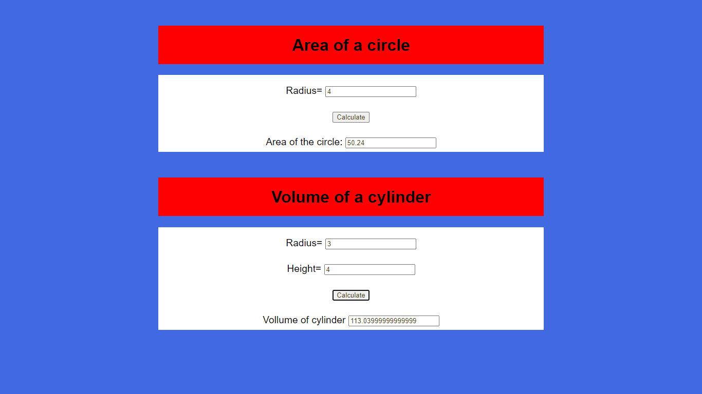
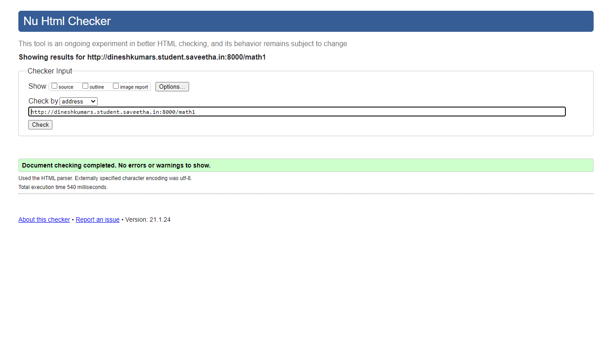

# Mathematical Calculations using JavaScript
## AIM:
To design a website to calculate the area of a circle and volume of a cylinder using JavaScript.

## DESIGN STEPS:
### Step 1: 
Requirement collection.
### Step 2:
Creating the layout using HTML and CSS.
### Step 3:
Write JavaScript to perform calculations.
### Step 4:
Choose the appropriate style and color scheme.
### Step 5:
Validate the layout in various browsers.
### Step 6:
Validate the HTML code.
### Step 7:
Publish the website in the given URL.


## PROGRAM:

## HTML File:
### math1.html:
```

<!DOCTYPE html>
<html>

<head>
    <title>Math Calculations</title>
    <link rel="stylesheet" href="">
</head>

<body>
    <div class="container">
        <div class="formview">
            <h1 class="banner">
                Area of a circle
            </h1>
            <div class="content">
                <form>
                    
                    <div class="forminput">
                        <label for="radius">Radius=</label>
                        <input type="text" name="radius" id="radius">
                    </div>                    
                    <div class="forminput">
                        <button type="button" name="circle_area" id="circle_area">Calculate</button>
                    </div>
                    <div class="forminput">
                        <label for="answer">Area of the circle: </label>
                        <input type="text" name="answer" id="answer">
                    </div>
                </form>
            </div>
        </div>
    </div>    
    <div class="container">
        <div class="formview">
            <h1 class="banner">
                 Volume of a cylinder
            </h1>
            <div class="content">
                <form>
                    
                    <div class="forminput">
                        <label for="r">Radius=</label>
                        <input type="text" name="r" id="r">
                    </div>
                    <div  class="forminput">
                        <label for="h">Height=</label>
                        <input type="text" name="h" id="h">
                    </div>                    
                    <div class="forminput">
                        <button type="button" name="btn_vol_cyn" id="btn_vol_cyn">Calculate</button>
                    </div>
                    <div class="forminput">
                        <label for="answ">Vollume of cylinder</label>
                        <input type="text" name="answ" id="answ">
                    </div>
                </form>
            </div>
        </div>
    </div>
    <script src="/static/js/math1.js"></script>
</body>
</html> 
```

## CSS File:
### math.css:
```
*{
      box-sizing: border-box;
      font-family: Arial, Helvetica, sans-serif;
      color: black;
}

body, html{
    margin-top: 0px;
    margin-right: 0px;
    margin-bottom: 0px;
    margin-left: 0px;
    padding: 0px;
    background-color: royalblue;
}

.container{
    width: 750px;
    margin-left: auto;
    margin-right: auto;
}

.formview{
    justify-content: center;
    margin-top: 50px; 
}

.forminput{
    height: 50px;
    padding-top: 20px;
    padding-bottom: 20px;
    font-size: larger;
}

.banner{
    display: block;
    width: 100%;
    background-color: red;
    padding-top: 20px;
    text-align: center;
    height: 75px;
}

.content{
    display: block;
    width: 100%;
    background-color: white;
    text-align: center;
}

input{
    color: #4E3C14;
}
button{
    color: #4E3C14;
}
```

## Javascript code:
### math1.js:
```
alert("welcome")

addbtn = document.querySelector("#circle_area");
addbtn.addEventListener('click',function(e){
    a=document.querySelector("#radius");
    ans=document.querySelector('#answer');
    let b;
    b=3.14*parseFloat(a.value)*parseFloat(a.value);
    ans.value=b;
});

adbtn = document.querySelector("#btn_vol_cyn");
adbtn.addEventListener('click',function(e){
    c=document.querySelector("#r");
    d=document.querySelector('#h');
    answer=document.querySelector('#answ');
    let f;
    f=3.14*parseFloat(c.value)*parseFloat(c.value)*parseFloat(d.value);
    answer.value=f;
});
```

## OUTPUT:


## REPORT:


## RESULT:
Thus a website is created to calculate area of circle and volume of cynlinder.This is hosted in the URL, http://dineshkumars.student.saveetha.in:8000/math1 . HTML code is validated.